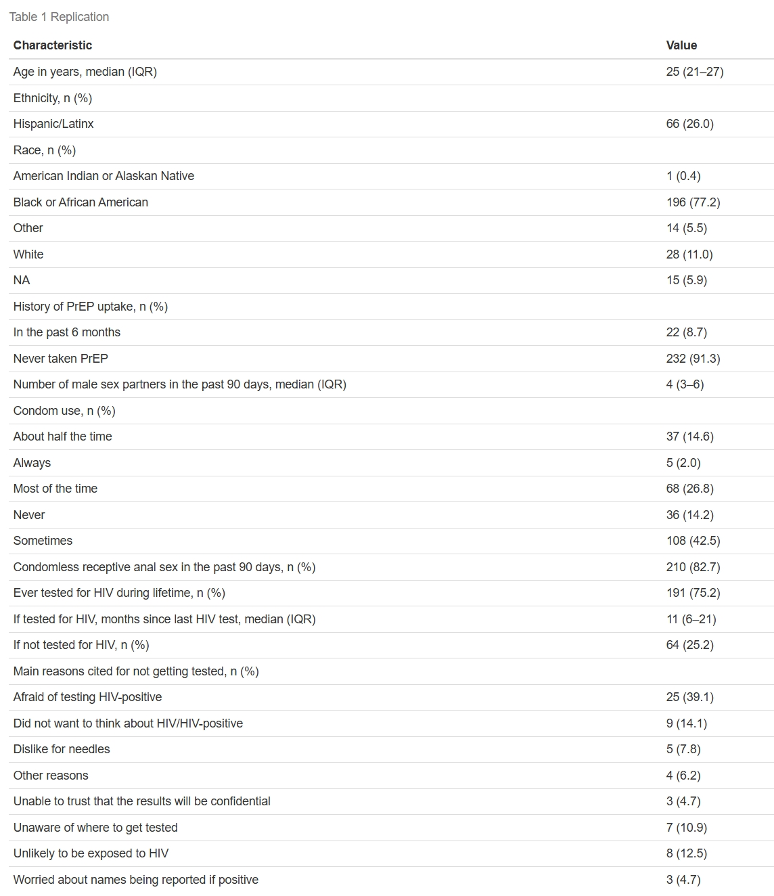
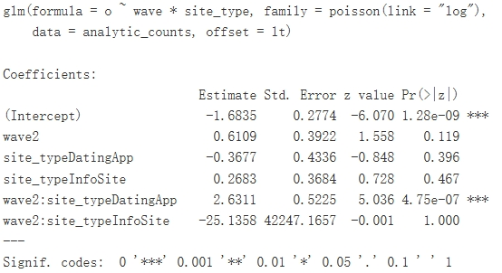
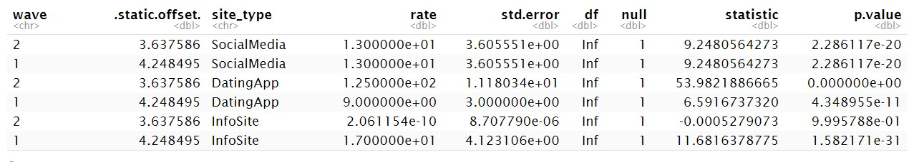
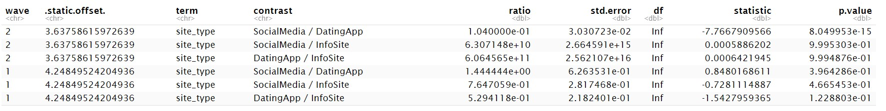
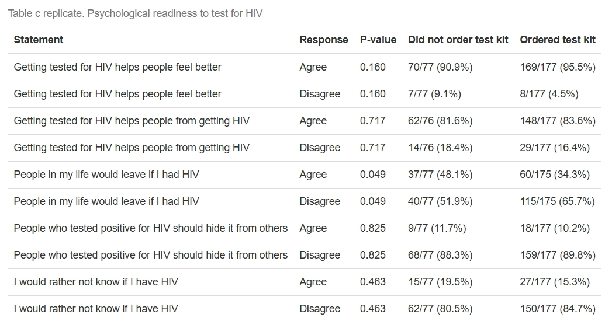
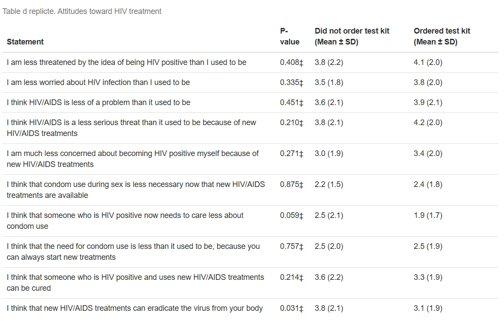
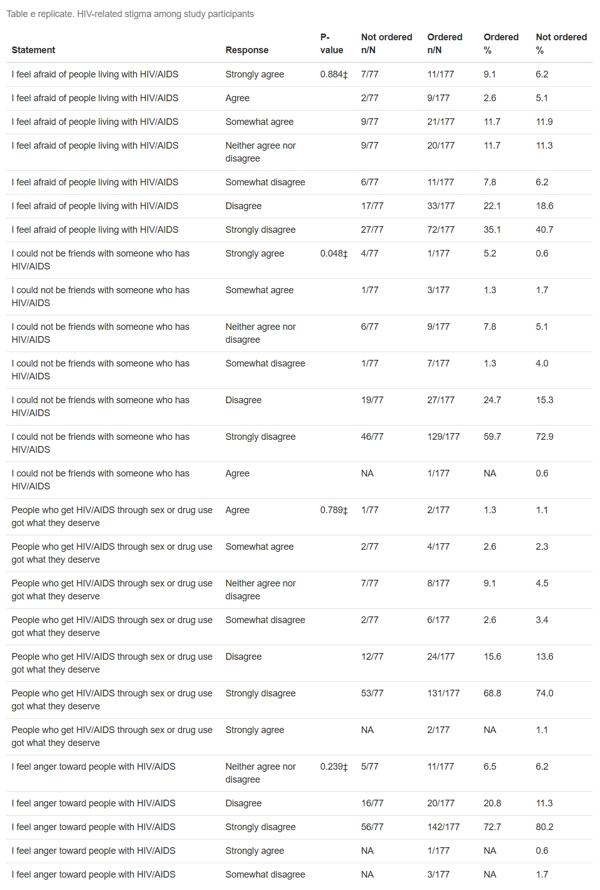
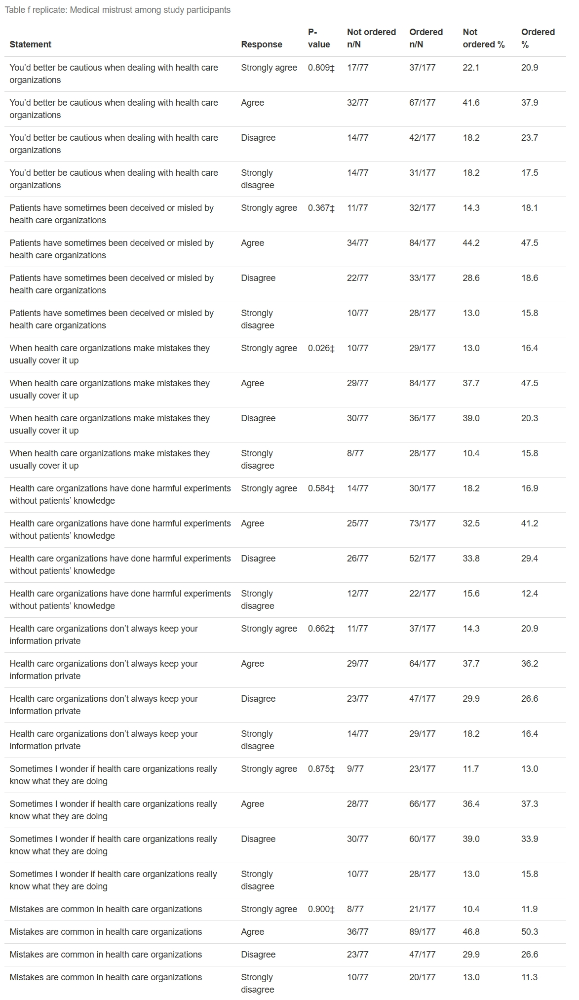

# Replication of "Relative Effectiveness of Social Media, Dating Apps, and Information Search Sites in Promoting HIV Self-testing"

## 1. Study Overview
Facing the inadequate HIV testing uptake among populations at high risk, optimizing the promotion of HIV self-testing has become important. Channels like digital recruitment platforms may be promising for promoting HIV self-testing and test-kit distribution. However, comparative evidence on the effectiveness of these platforms remains limited. Thus, the original study was carried out to answer those questions.

The primary objective of the study is to compare HIV self-test kit ordering rates across three platform types (social media, dating apps, and information search sites) during two recruitment waves.

The secondary objective is to evaluate the association of key moderating variables-substance use, psychological readiness to test, and perceptions and attitudes related to HIV testing-with the ordering of HIV self-testing kits.

## 2. Replicated Results

### 2.1 Replicated Table 1

Comparing the replicated Table 1 with the original table in the manuscript, although small deviations exist in a few cells, core summary statistics like sizes, proportions, and distributions all closely mirror those reported in the original study. Hence, the overall precision of Table 1's replication is strong.

### 2.2 Primary Analysis
The primary analysis was replicated using a Poisson regression model with a log link and an offset for exposure time: $\log(o_{ij}) = \log(t_i) + \alpha + \beta_i + \gamma_j + (\beta\gamma)_{ij}$.
- Outcome: number of HIV self-test kits ordered
- Predictors: recruitment wave, platform type, and their interaction
- Offset: log of exposure time

**The model outputs are:**

**The cell specific rates outputs:**

**The contrast table:**

As an interpretation: In Wave 1, there were no statistically significant differences in HIV self-test ordering rates across the three platform types.In Wave 2, there is strong evidence of platform differences, driven by a substantially higher ordering rate among participants recruited through dating apps. Information search sites recorded zero orders in Wave 2, leading to extremely large or unstable coefficient estimates. This phenomenon reflects complete separation, which is expected and also reported in the original manuscript.

Besides, the estimated cell-specific rates clearly show that dating apps are the most effective recruitment channel in Wave 2, while social media and information search sites performed comparatively worse. The contrast table also confirm that, in Wave 2, dating apps had significantly higher ordering rates than social media, whereas comparisons involving information search sites were unstable due to non-event cells.

Overall, I think these findings closely mirror the primary analysis conclusions reported in the original manuscript

### 2.3 Secondary Analysis
The secondary analysis focused on replicating the secondary objective described in the main manuscript. Specifically, this involved examining how psychological readiness to test, HIV-related stigma, attitudes toward HIV treatment, and medical mistrust were associated with HIV self-test kit ordering.

My approach is that for each secondary outcome domain, participants were grouped by whether they ordered an HIV self-test kit (ora_within60_yesno). Summary statistics were calculated separately for those who ordered a kit and those who did not. Depending on the nature of the variable. For categorical or scale variables were summarized using counts and percentages, and compared using Fisher's exact test. While continuous variables were summarized using means and standard deviations, and compared using the Wilcoxon rank-sum test. My use of test follows the original study's appendix 3

Replicated Tables.

**Replicate of Table c:**

**Replicate of Table d:**

**Replicate of Table e:**

**Replicate of Table f:**

I did not replciate table a and b from Appendix because the corresponding data fields could not be clearly identified in the provided data dictionary (I've spend a lot time on this but still not sure where those data fields are mapped to).

For the rest of the four tables, I compared my tables and the tables in the appendix 3, the summary statistics in these replicated tables match those from the original study. Although some p-values differ slightly due to rounding or implementation details, the direction and statistical significance of results are consistent with the original findings. So from my replicates, as aligned with the original tables, participants generally expressed low levels of overt HIV-related stigma, with only a small proportion agreeing with statements reflecting fear or social rejection of people living with HIV. Medical mistrust was relatively common, with many participants endorsing beliefs that health care organizations make mistakes or mislead patients.Besides, attitudes toward HIV prevention and treatment also showed comparable patterns like moderate concerns about medications.

Overall, I think the replicated tables reproduce both the distributional patterns and interpretations described in the original manuscript.

## 3. Reflections
Overall, this replication experience was both challenging and meaningful. I think one of the most significant challenges was variable interpretation. Many survey variables required me to carefully consult the data dictionary to ensure that the correct fields and response codings were used. I spent a substantial amount of time reading the data dictionary, interpreting what the authors intended for each variable referenced in the manuscript, and then matching those variables to the analytic dataset.

Another major challenge involved inconsistent response encodings across survey items. For example, some scale questions used the coding:
- 28 = Strongly agree
- 30 = Agree
- 33 = Disagree
- 34 = Strongly disagree

while others used:
- 1 = Strongly agree
- 2 = Agree
- 6 = Disagree
- 7 = Strongly disagree

My code failed several times until I reviewed data dictionary carefully again and again, and found these inconsistencies. Fixing those inconsistencies enabled me to continue on statistical analysis and testing.

One additional challenges I met is that terminology clarity, as the term "secondary analysis" was used differently in the manuscript and appendices. In manuscript, it refers to analysis for the secondary objective while in appendix 1, it refers to sensitivity analysis of the primary analysis. This confuses me initially, but I made distinction between secondary analyses of the primary outcome and analyses of secondary outcomes after carefully reading the manuscript and the requirement once again.

Despite these challenges, the replicated results align closely with the published findings. There is no denying that some minor numerical differences exists, which reflect modeling and implementation choices rather than substantive disagreement. Through this challenging but interesting study replication experience, I understood the importance of transparent documentation, careful data management, and close attention to methodological detail so that research can be reproduced more easily in the future.

## 4. References
- Original Manuscript: Relative Effectiveness of Social Media, Dating Apps, and Information Search Sites in Promoting HIV Self-testing
- Multimedia Appendix 1: Primary outcome analysis.
- Multimedia Appendix 3: Secondary outcomes.
- National Institute on Drug Abuse (NIDA) website
- Main R packages used for replication: tidyverse, stats (for glm and statistical tests), dplyr, tidyr, emmeans, knitr